# deckpad

Piloter son PC depuis une tablette pendant qu'on joue : des pages par thème, en swipe, avec de grosses tuiles.

- `agent/` : programme Go qui tourne sur le PC (API + appli tablette embarquée), un seul `.exe`.
- `web/` : appli tablette (React + Vite + Swiper), installable en PWA.

## Aperçu

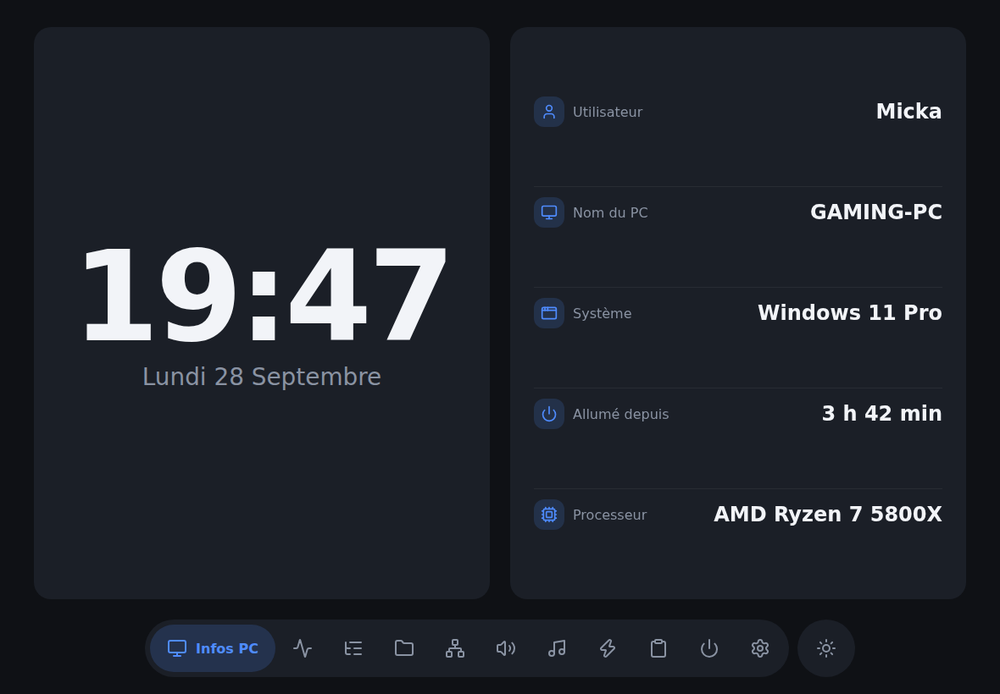

| | |
|---|---|
|  Stats | 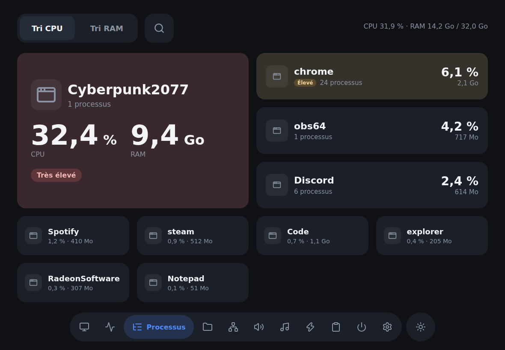 Processus |
| 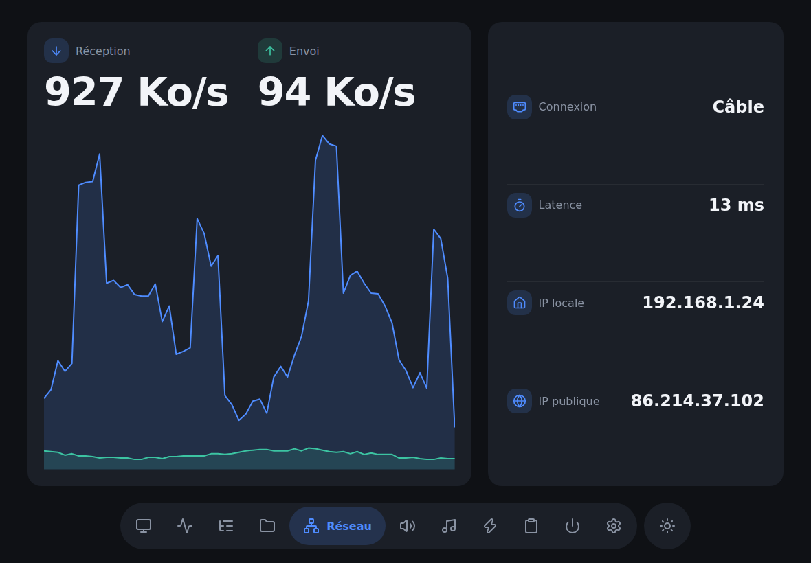 Réseau |  Audio |
| 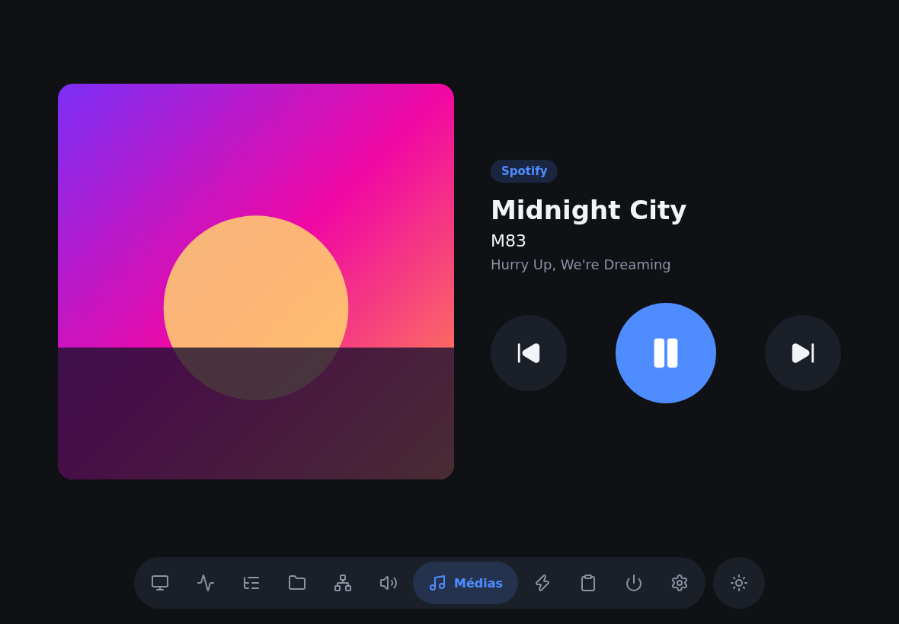 Médias | 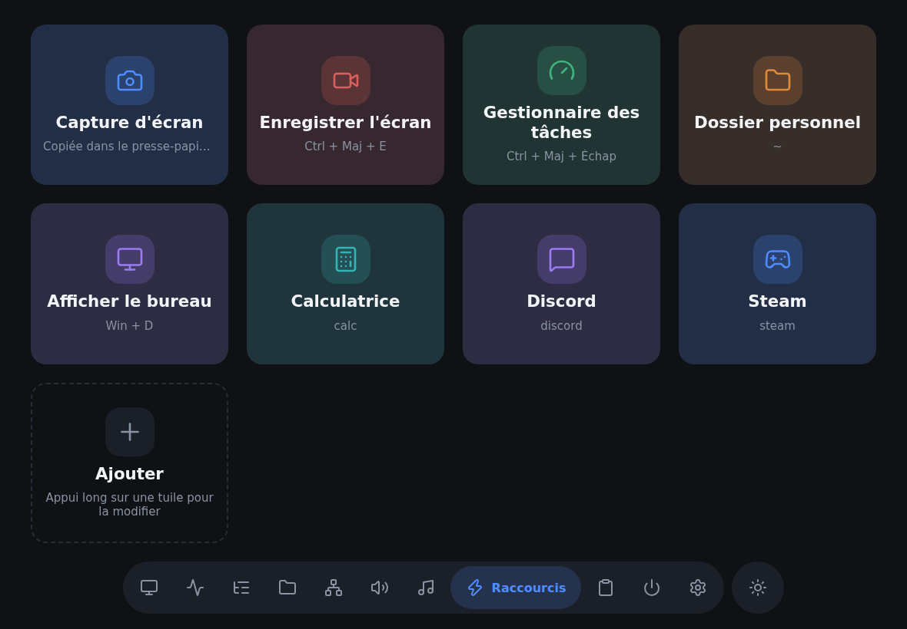 Raccourcis |
| 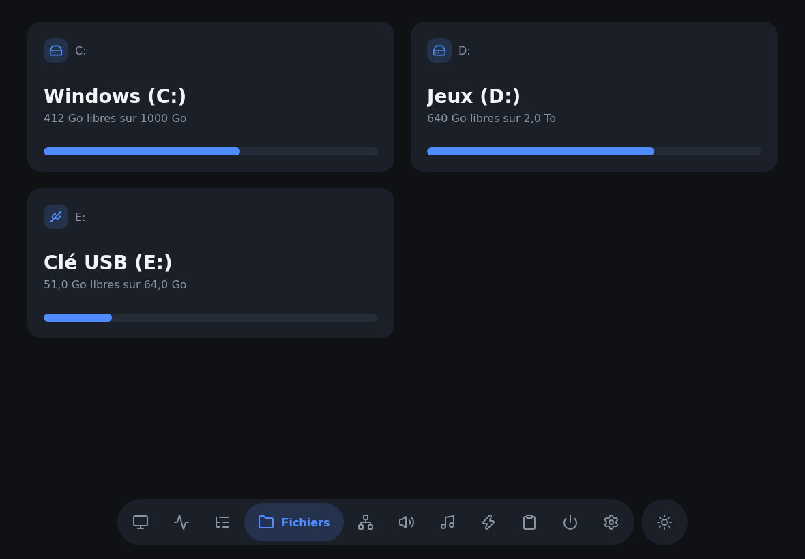 Fichiers | 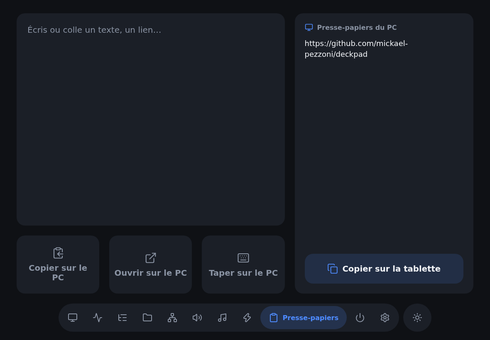 Presse-papiers |
| 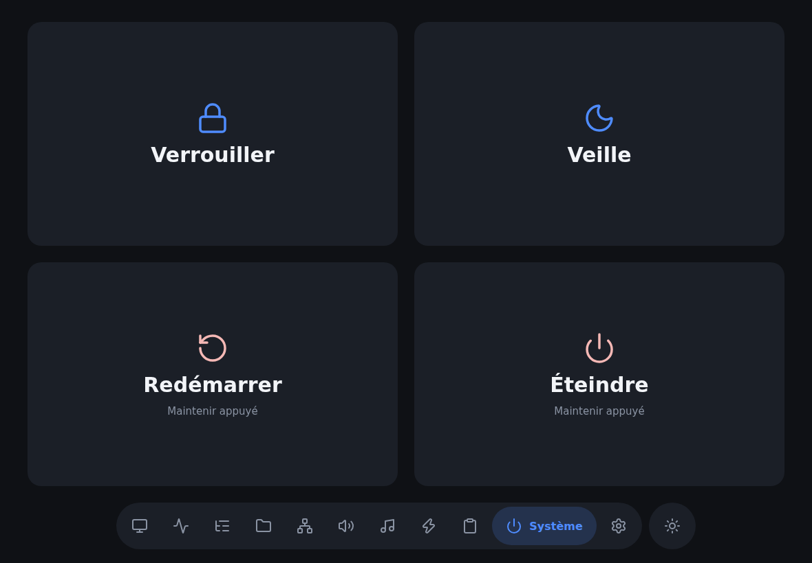 Système | 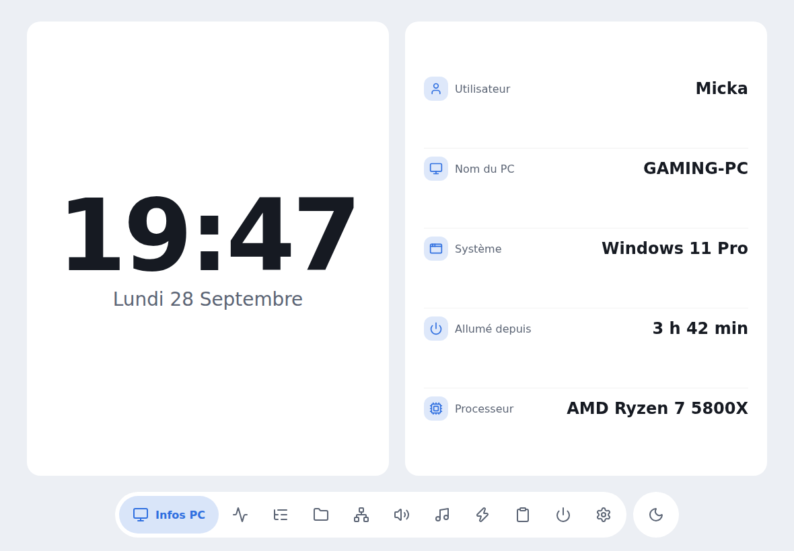 Thème clair |
| 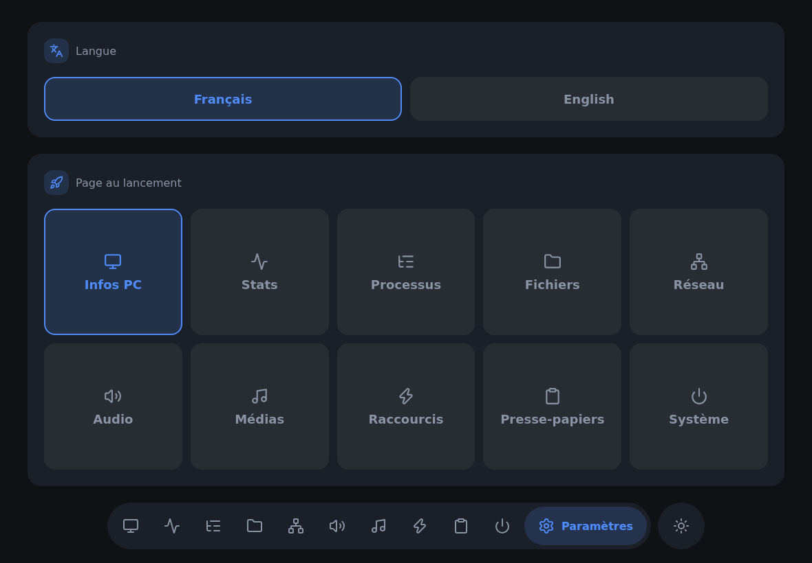 Paramètres | 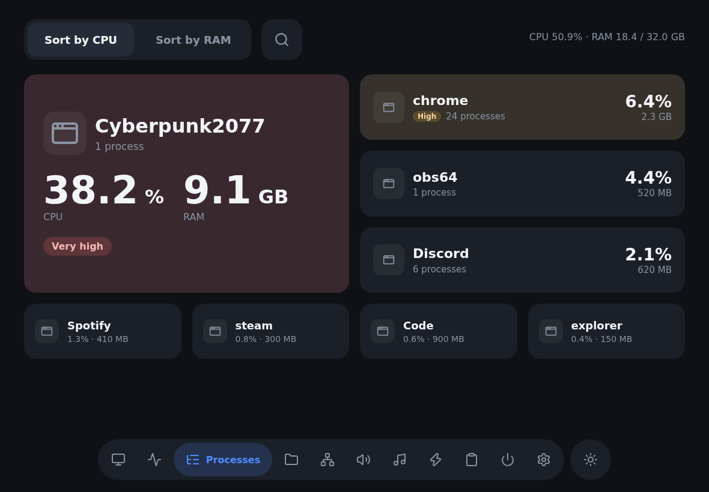 En anglais |

Sur téléphone aussi :

<p>
  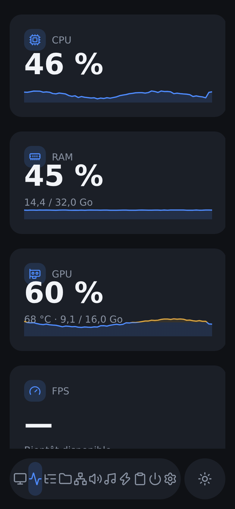
  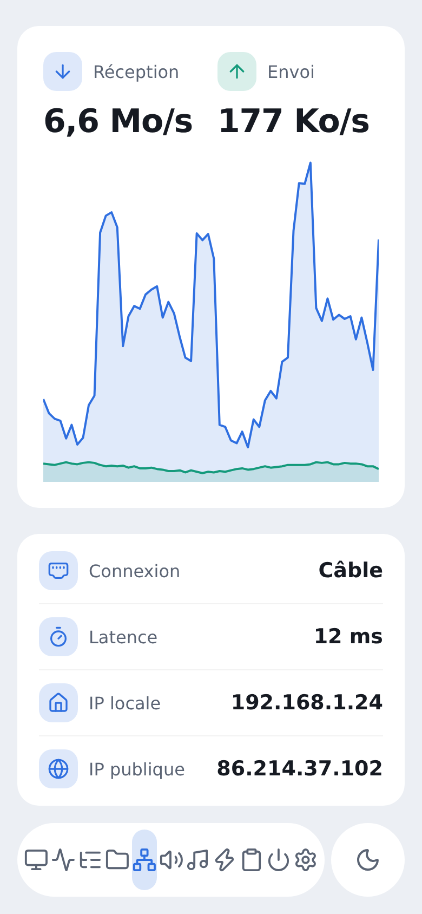
</p>

## Utiliser

1. Lancer `deckpad.exe` sur le PC. Il affiche l'adresse à ouvrir (ex : `http://192.168.1.20:8420`).
2. Ouvrir cette adresse sur la tablette, puis « Ajouter à l'écran d'accueil ».

### Installer l'appli sur la tablette (PWA)

Les navigateurs n'installent une vraie appli (plein écran, icône, cache) qu'en HTTPS. deckpad sert donc aussi l'appli en HTTPS sur le port 8421, avec son propre certificat.

Juste après l'appairage, la tablette propose de passer en connexion sécurisée, en 3 étapes (une seule fois) :

1. « Télécharger le certificat ».
2. Android : dans Paramètres, chercher « Certificat CA » et choisir `deckpad-ca.crt`. iPad : Réglages › Profil téléchargé › Installer, puis Réglages › Général › Informations › Réglages des certificats, activer deckpad.
3. « Continuer en sécurisé » : la tablette passe en HTTPS sans refaire l'appairage. Il ne reste qu'à installer l'appli (menu ⋮ → « Installer l'application » sur Chrome).

À savoir :

- Au premier lancement, deckpad crée sa petite autorité de certification dans `%APPDATA%\deckpad` (Windows) ou `~/.config/deckpad` (Linux) : `ca.crt` et `ca.key`. La clé ne quitte jamais le PC. Elle ne peut signer que des adresses du réseau local, donc elle ne servirait à rien pour se faire passer pour un autre site.
- Si l'adresse du PC change, le certificat est refait tout seul, sans rien réinstaller sur la tablette.
- Android affiche ensuite « le réseau peut être surveillé » : c'est normal après l'installation d'un certificat.
- `-https-addr ""` désactive le HTTPS. En mode développement, le HTTPS sert l'appli construite : lancer `npm run build` avant de tester cette étape.

Sans certificat, sur Android, on peut aussi activer `chrome://flags/#unsafely-treat-insecure-origin-as-secure` avec l'adresse HTTP du PC, puis installer l'appli.

### Appairer une tablette

Tant qu'aucune tablette n'est appairée, le PC ouvre au lancement une petite fenêtre avec un QR code de l'adresse à ouvrir. La tablette affiche ensuite un pavé numérique et la fenêtre un code à 6 chiffres (aussi écrit dans la console). Taper ce code sur la tablette : elle reçoit une clé et n'aura plus à le refaire.

- Le code expire après 5 minutes et se bloque après 5 erreurs.
- Chaque appareil a sa propre clé. Le PC n'en garde que l'empreinte, dans `%APPDATA%\deckpad\devices.json` (Windows) ou `~/.config/deckpad/devices.json` (Linux). Supprimer ce fichier désappaire tout.
- La fenêtre s'ouvre avec Edge ou Chrome (Chromium sous Linux), sinon dans le navigateur par défaut.

## Construire l'exe

Prérequis : [Go](https://go.dev/dl/) et [Node.js](https://nodejs.org/).

```
.\build.ps1      # Windows
./build.sh       # macOS / Linux
```

Résultat : `bin/deckpad.exe`.

## Développer

Deux terminaux :

```
cd agent && go run .        # API sur :8420
cd web && npm install && npm run dev
```

Ouvrir l'adresse affichée par Vite (sur le PC ou la tablette). L'appli se recharge à chaque sauvegarde et les appels `/api` sont redirigés vers l'agent.

Textes de l'appli : `web/src/i18n/fr.ts` et `web/src/i18n/en.ts` (react-i18next). Un texte ajouté en français doit l'être aussi en anglais : la compilation échoue sinon.

## Pages

| Page | État |
|---|---|
| Infos PC | ✅ |
| Stats | ✅ CPU, RAM, GPU toutes marques (FPS et température GPU AMD sous Windows à venir) |
| Processus | ✅ applications de l'utilisateur, tri CPU/RAM, fermeture avec confirmation |
| Fichiers | ✅ disques et clés USB, navigation dans les dossiers (lecture seule) |
| Réseau | ✅ débit en direct, latence, IP locale et publique, type de connexion |
| Audio | ✅ volume général et par appli, micro, choix de la sortie (casque, enceintes…). Sous Linux : `pactl` requis (fourni avec PulseAudio / PipeWire) |
| Médias | ✅ titre, artiste, pochette, lecture/pause, suivant/précédent (Spotify, YouTube dans le navigateur, VLC…). Windows 10 1809+ ; sous Linux, tout lecteur compatible MPRIS |
| Raccourcis | ✅ tuiles configurables depuis la tablette (appui long pour modifier) : combinaison de touches, programme, dossier ou adresse web, capture de l'écran copiée dans le presse-papiers. Enregistrés dans `%APPDATA%\deckpad\shortcuts.json` (Windows) ou `~/.config/deckpad/shortcuts.json` (Linux). Sous Linux, les touches demandent `xdotool` (X11) ou `ydotool` (Wayland), la capture `gnome-screenshot`, `spectacle`, `grim` + `wl-copy` ou `maim` + `xclip` |
| Presse-papiers | ✅ envoyer un texte au PC (copier, ouvrir, taper), voir le presse-papiers du PC, historique |
| Système | ✅ verrouiller, veille, redémarrer, éteindre (appui long) |
| Paramètres | ✅ langue (français / anglais, celle du navigateur au premier lancement) et page affichée au lancement, mémorisées sur la tablette |
